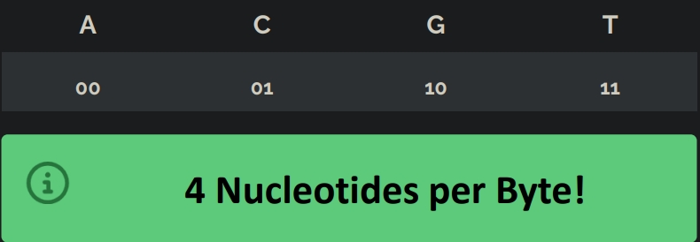
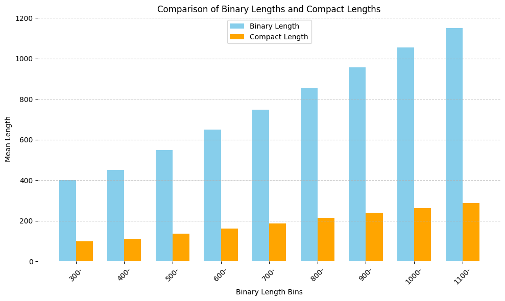
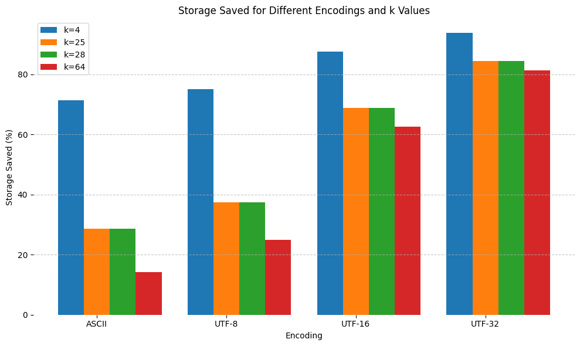
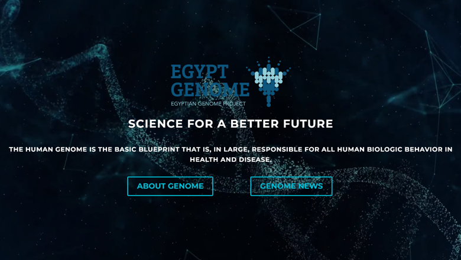

# Compact Representations in Protein Databases

This research examines the application of compact
representations for DNA sequences to efficiently manage and
reduce the storage requirements of genetic data.

## Limitations of Traditional DNA Representation

- Each DNA nucleotide represented by a single character `1 Byte = 8 Bits`
- Large file sizes for genomic data, consuming **significant storage**

## Our Proposed Integration

**Binary encoding** assigns **`2 bits`** per nucleotide, efficiently
representing the **4 DNA bases.**

In **`Encoding.sql`** and **`Decoding.sql`** we implemented sql functions to encode the 4 DNA Bases and to decode them efficiently,
Through binary Compact storing.

## Dataset

In **`Try.py`** you can find that we Generated **1000 random DNA** sequences and protein sequences.

- Mean length of 100
- A standard deviation of 50
  Ensuring variability in sequence lengths​​.

## Storage Saved

And in **`helpers.py`** you can find The functions **storage_saved** and **enc_saved** calculate the storage saved for a given **k** value and **encoding: -**

### storage_saved(k, n)

Calculates the storage savings for k possible characters and encoding size n.

**k:** Number of possible characters.

**n:** Encoding size in bits.

### enc_saved(k, encoding):

Calculates the storage savings for a given k value and encoding type.

**k:** Number of possible characters.

**encoding:** Encoding type (e.g., **"ASCII"**, **"UTF-8"**, **"UTF-16"**, **"UTF-32"**).

## Egyptian Genome Project

Our findings hold promise for the Egypt Genome project, providing a blueprint for efficient data management and analysis. By leveraging compact representations, the project can optimize storage utilization and computational resources, accelerating genomic research in Egypt and beyond.

    
    
  

